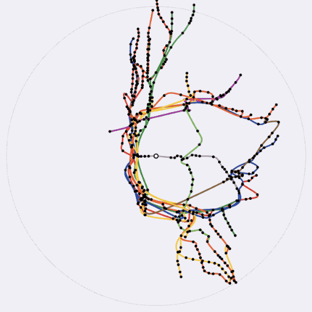

# NYC Travel Time Map

## How does it work?

The main page is `index.html`, but most of the code is in `map.js`. `map.js` uses `d3.js` to render the map based on JSON data
generated by a couple Python scripts.

If you'd like to set this up yourself, you'll need to unzip the `google_transit.zip` file into this directory, then run
 `python3 generate_routes_json.py` and `python3 gtfs_json.py` to generate the required `subway.js` and `gtfs_json.js` files.
 These are required by `virtual_rider.js`, which implements Djiksta-like algorithm for simulating a rider's journey
 from a starting stop throughout the system. `virtual_rider.js` is invoked by `map.js` whenever a stop is clicked,
 and the results are used to shift the distance of each stop away from the clicked stop.
